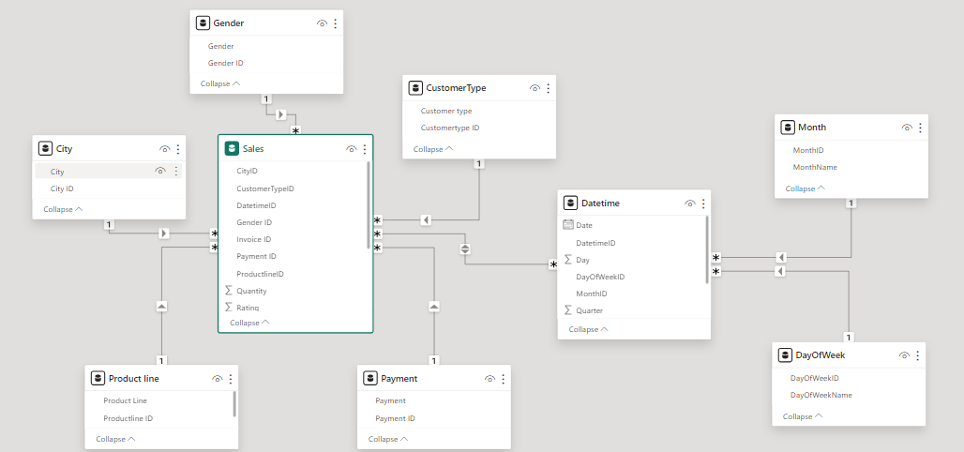

# Data Analysis of PUP Supermarket Chain in 2019

## About the Repository

This repository contains only the parts of the project that I personally contributed to, showcasing my skills in data preprocessing, analysis, and data-driven recommendations. Please note that I was actively involved in the entire data analysis process as part of the group, which included reviewing others' work, offering recommendations to enhance the overall quality, and incorporating feedback to complete the project. For a full overview of the project or to see the group work, please contact me directly. Feel free to review my work and reach out if you have any questions or need further information.

## Technologies Used
- **Excel**: For data cleaning, transformation, and modeling.
- **PowerBI**: For creating visual dashboards.

## Project Overview

The goal of this project was to analyze the sales data of PUP supermarkets to identify trends, customer behavior, and product performance. The analysis provided valuable insights to help the supermarket chain make informed decisions for enhancing sales and customer satisfaction. 

## Key Contributions

- **Data Preprocessing**:
Consolidated and cleaned the sales data to ensure accuracy and consistency.
Transformed the data into a format suitable for in-depth analysis.
- **Data Analysis**:
Focused on analyzing product lines to determine the best-selling items and customer preferences.
Developed a dashboard page that visualizes key metrics and trends within the product lines.
- **Recommendations**:
Proposed strategies to optimize inventory management, pricing, and promotional activities based on the analysis.
Suggested actionable insights to boost sales and customer engagement.

## About PUP 

PUP Supermarket, established in 2018, operates in the retail sector, focusing on essential consumer goods. With branches in Yangon, Naypyitaw, and Mandalay, it caters to the general public, meeting the shopping needs of local residents. As a growing business, PUP has significant potential to enhance its operations and customer experience through effective data analysis, aiming to secure a leading position in the retail industry.

  
  
<i>PUP logo (Source: Author's group)</i>

*! Just for fun: The text on the logo means Buy 1, Get 1 Free, Pay for 2*

## Data Source
The data from PUP Supermarket is based on the **Supermarket Sales** dataset from Kaggle, which can be accessed [here](https://www.kaggle.com/datasets/aungpyaeap/supermarket-sales). This dataset includes sales records of a supermarket across three branches, providing insights into various aspects such as customer demographics, purchase behavior, and sales trends over time.

## Data Description

The data is sourced from Kaggle and includes the following attributes:

1. **Invoice ID**: Unique identifier for each invoice, generated by the computer.
2. **City**: The city where the supermarket branch is located.
3. **Customer Type**: Classification of customers as either Members (using a membership card) or Normal (not using a membership card).
4. **Gender**: The gender of the customer.
5. **Product Line**: General category of the product, including: Electronics, Fashion Accessories, Food and Beverages, Health and Beauty, Household and Lifestyle, Sports and Travel.
6. **Unit Price**: Price of each product (in dollars).
7. **Quantity**: Number of products purchased by the customer.
8. **Tax**: 5% VAT applied to the purchase.
9. **Total**: Total invoice amount including tax.
10. **Date**: Purchase date (data ranges from January 2019 to December 2019).
11. **Time**: Purchase time (from 10 AM to 9 PM).
12. **Payment**: Payment method used by the customer (Cash, Credit Card, Ewallet).
13. **Rating**: Customer rating of the purchase experience.

## Data Preprocessing

The data preprocessing phase involved several steps to ensure the quality and usability of the data for analysis. Below are the key preprocessing tasks I performed.

### 1. Data Consolidation
The data used for this project was sourced from a single location on Kaggle. The dataset selected is named “Supermarket Sales” and was downloaded directly from Kaggle in CSV format.

### 2. Data Cleaning
The “Supermarket Sales” dataset from Kaggle was quite clean. There were no missing values, duplicate records, or errors in the data. Therefore, no additional data cleaning steps were required.

### 3. Data Transformation
During the data transformation phase, several new attributes were created from the existing date and time data. From the `Date` column, five additional attributes were generated. Two of these attributes were split into new dimensions, which will be discussed in more detail in the Data Model section. The new attributes include:
- **Date**
- **Month**
- **Year**
- **Quarter**
- **DayofWeek**

In addition to the new categorical attributes, a numerical attribute was created to represent the revenue after tax. This column, named `revenue`, was calculated by multiplying `Unit Price` by `Quantity`.

Along with generating new data, categorical encoding was performed for columns containing categorical data. A total of eight columns were encoded. However, one column, `Branch`, was removed due to data redundancy, which will be explained in more detail in the Data Reduction section. Below are the columns that were encoded and their encoding:

- **City**
  | Original Data | Encoded Data |
  |---------------|--------------|
  | Mandalay      | MAN          |
  | Naypyitaw     | NAY          |
  | Yangon        | YAN          |

- **Customer Type**
  | Original Data | Encoded Data |
  |---------------|--------------|
  | Member        | MEM          |
  | Normal        | NOR          |

- **Gender**
  | Original Data | Encoded Data |
  |---------------|--------------|
  | Female        | F            |
  | Male          | M            |

- **Product Line**
  | Original Data         | Encoded Data |
  |-----------------------|--------------|
  | Health and Beauty     | HB           |
  | Electronic Accessories | EA          |
  | Home and Lifestyle    | HL           |
  | Sports and Travel     | ST           |
  | Fashion Accessories   | FA           |
  | Food and Beverages    | FB           |

- **Date and Time**
  Date and Time were encoded in a specific format due to their varied data ranges: “yyyymmddhhmm”. For example, a `Date` of “2019/05/01” and `Time` of “13:08” would be encoded as “201905011308”.

- **Payment**
  | Original Data | Encoded Data |
  |---------------|--------------|
  | Cash          | CA           |
  | Credit Card   | CR           |
  | E-wallet      | EW           |

### 4. Data Reduction
`Branch` was not the only column removed as mentioned earlier. In addition to `Branch`, columns `COGS` and `Gross Margin` were also removed. The `Branch` column was eliminated because its data was redundant with the `City` data; each City corresponds to a Branch and vice versa. In other words, `Branch` was essentially a coded version of `City`. Therefore, `Branch` was removed to avoid redundancy and focus on more meaningful information.

For `COGS` (Cost of Goods Sold), it was found that the data did not reflect its intended meaning. The `COGS` data was essentially the result of multiplying `Unit Price` by `Quantity`. Since `Unit Price` represents the selling price, not the cost of producing the product, `COGS` was removed.

According to Investopedia, Gross Margin = Net Sales − COGS (Bloomenthal, n.d.). Since `COGS` was removed due to incorrect data representation, `Gross Margin` was also removed. Furthermore, the `Gross Margin` column contained only a single value across 1,000 rows, indicating potential unreliability. Thus, the `Gross Margin` column was removed to ensure data quality for analysis.

## Data Model

After preprocessing the data, I imported it into PowerBI and linked the datasets to create the data model, which is visualized in the image below.

  
  
<i>Data Model (Source: Author's group)</i>

## Data Analysis

