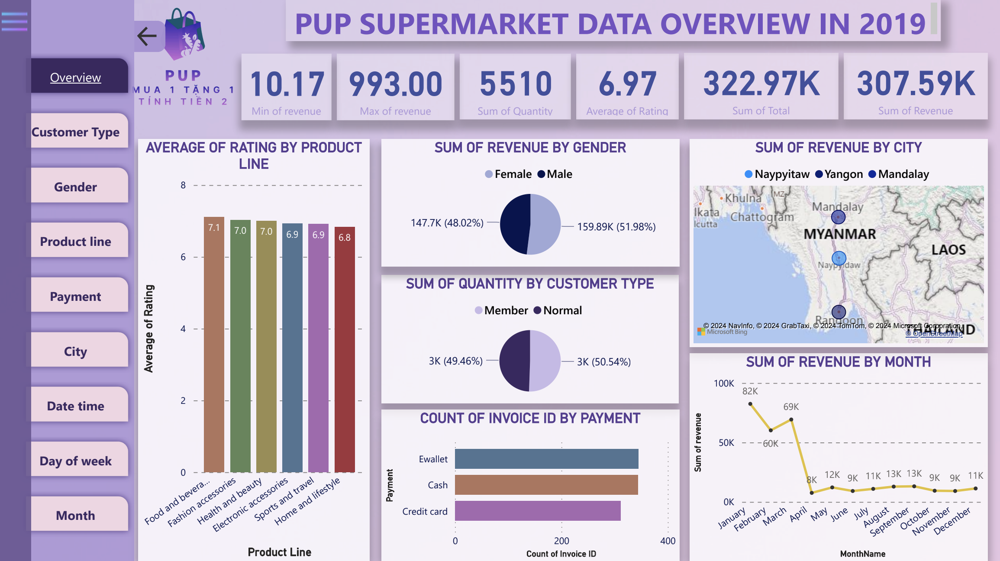

# Data Analysis of PUP Supermarket Chain in 2019

## About the Repository

This repository contains only the parts of the project that I personally contributed to, showcasing my skills in data preprocessing, analysis, and data-driven recommendations. Please note that I was actively involved in the entire data analysis process as part of the group, which included reviewing others' work, offering recommendations to enhance the overall quality, and incorporating feedback to complete the project. For a full overview of the project or to see the group work, please contact me directly. Feel free to review my work and reach out if you have any questions or need further information.

## Technologies Used
- **Excel**: For data cleaning, transformation, and modeling.
- **PowerBI**: For creating visual dashboards.

## Project Overview

The goal of this project was to analyze the sales data of PUP supermarkets to identify trends, customer behavior, and product performance. The analysis provided valuable insights to help the supermarket chain make informed decisions for enhancing sales and customer satisfaction. 

## Key Contributions

- **Data Preprocessing**:
Consolidated and cleaned the sales data to ensure accuracy and consistency.
Transformed the data into a format suitable for in-depth analysis.
- **Data Analysis**:
Focused on analyzing product lines to determine the best-selling items and customer preferences.
Developed a dashboard page that visualizes key metrics and trends within the product lines.
- **Recommendations**:
Proposed strategies to optimize inventory management, pricing, and promotional activities based on the analysis.
Suggested actionable insights to boost sales and customer engagement.

## About PUP 

PUP Supermarket, established in 2018, operates in the retail sector, focusing on essential consumer goods. With branches in Yangon, Naypyitaw, and Mandalay, it caters to the general public, meeting the shopping needs of local residents. As a growing business, PUP has significant potential to enhance its operations and customer experience through effective data analysis, aiming to secure a leading position in the retail industry.

  
  
<i>PUP Logo (Source: Author group)</i>

*! Just for fun: The text on the logo means Buy 1, Get 1 Free, Pay for 2*

## Data Source
The data from PUP Supermarket is based on the **Supermarket Sales** dataset from Kaggle, which can be accessed [here](https://www.kaggle.com/datasets/aungpyaeap/supermarket-sales). This dataset includes sales records of a supermarket across three branches, providing insights into various aspects such as customer demographics, purchase behavior, and sales trends over time.

## Data Description

The data is sourced from Kaggle and includes the following attributes:

1. **Invoice ID**: Unique identifier for each invoice, generated by the computer.
2. **City**: The city where the supermarket branch is located.
3. **Customer Type**: Classification of customers as either Members (using a membership card) or Normal (not using a membership card).
4. **Gender**: The gender of the customer.
5. **Product Line**: General category of the product, including: Electronics, Fashion Accessories, Food and Beverages, Health and Beauty, Household and Lifestyle, Sports and Travel.
6. **Unit Price**: Price of each product (in dollars).
7. **Quantity**: Number of products purchased by the customer.
8. **Tax**: 5% VAT applied to the purchase.
9. **Total**: Total invoice amount including tax.
10. **Date**: Purchase date (data ranges from January 2019 to December 2019).
11. **Time**: Purchase time (from 10 AM to 9 PM).
12. **Payment**: Payment method used by the customer (Cash, Credit Card, Ewallet).
13. **Rating**: Customer rating of the purchase experience.

## Data Preprocessing

The data preprocessing phase involved several steps to ensure the quality and usability of the data for analysis. Below are the key preprocessing tasks I performed.

### 1. Data Consolidation
The data used for this project was sourced from a single location on Kaggle. The dataset selected is named “Supermarket Sales” and was downloaded directly from Kaggle in CSV format.

### 2. Data Cleaning
The “Supermarket Sales” dataset from Kaggle was quite clean. There were no missing values, duplicate records, or errors in the data. Therefore, no additional data cleaning steps were required.

### 3. Data Transformation
During the data transformation phase, several new attributes were created from the existing date and time data. From the `Date` column, five additional attributes were generated. Two of these attributes were split into new dimensions, which will be discussed in more detail in the Data Model section. The new attributes include:
- **Date**
- **Month**
- **Year**
- **Quarter**
- **DayofWeek**

In addition to the new categorical attributes, a numerical attribute was created to represent the revenue after tax. This column, named `revenue`, was calculated by multiplying `Unit Price` by `Quantity`.

Along with generating new data, categorical encoding was performed for columns containing categorical data. A total of eight columns were encoded. However, one column, `Branch`, was removed due to data redundancy, which will be explained in more detail in the Data Reduction section. Below are the columns that were encoded and their encoding:

- **City**
  | Original Data | Encoded Data |
  |---------------|--------------|
  | Mandalay      | MAN          |
  | Naypyitaw     | NAY          |
  | Yangon        | YAN          |

- **Customer Type**
  | Original Data | Encoded Data |
  |---------------|--------------|
  | Member        | MEM          |
  | Normal        | NOR          |

- **Gender**
  | Original Data | Encoded Data |
  |---------------|--------------|
  | Female        | F            |
  | Male          | M            |

- **Product Line**
  | Original Data         | Encoded Data |
  |-----------------------|--------------|
  | Health and Beauty     | HB           |
  | Electronic Accessories | EA          |
  | Home and Lifestyle    | HL           |
  | Sports and Travel     | ST           |
  | Fashion Accessories   | FA           |
  | Food and Beverages    | FB           |

- **Date and Time**
  Date and Time were encoded in a specific format due to their varied data ranges: “yyyymmddhhmm”. For example, a `Date` of “2019/05/01” and `Time` of “13:08” would be encoded as “201905011308”.

- **Payment**
  | Original Data | Encoded Data |
  |---------------|--------------|
  | Cash          | CA           |
  | Credit Card   | CR           |
  | E-wallet      | EW           |

### 4. Data Reduction
`Branch` was not the only column removed as mentioned earlier. In addition to `Branch`, columns `COGS` and `Gross Margin` were also removed. The `Branch` column was eliminated because its data was redundant with the `City` data; each City corresponds to a Branch and vice versa. In other words, `Branch` was essentially a coded version of `City`. Therefore, `Branch` was removed to avoid redundancy and focus on more meaningful information.

For `COGS` (Cost of Goods Sold), it was found that the data did not reflect its intended meaning. The `COGS` data was essentially the result of multiplying `Unit Price` by `Quantity`. Since `Unit Price` represents the selling price, not the cost of producing the product, `COGS` was removed.

According to Investopedia, Gross Margin = Net Sales − COGS (Bloomenthal, n.d.). Since `COGS` was removed due to incorrect data representation, `Gross Margin` was also removed. Furthermore, the `Gross Margin` column contained only a single value across 1,000 rows, indicating potential unreliability. Thus, the `Gross Margin` column was removed to ensure data quality for analysis.

## Data Model

After preprocessing the data, I imported it into PowerBI and linked the datasets to create the data model, which is visualized in the image below.

  
  
<i>Data Model (Source: Author group)</i>

## Data Analysis

Each table depicted in the image corresponds to a dedicated dashboard. In this project, I contributed to the development of the overview dashboard for the fact table (`Sales`), while a teammate handled its analysis. Additionally, I was responsible for creating and analyzing the monthly dashboard for the `Month` table, providing recommendations based on the analysis. Let’s delve into my contributions.

### Overview Dashboard 

  
  
<i>Overview Dashboard (Source: Author group)</i>

The dashboard's content, including the number and types of charts and the data each chart displays, was developed with my assistance. However, the formatting and finalization of the dashboard were completed by my teammate. The dashboard highlights key business metrics (such as sales, revenue, and ratings) along with relevant dimensions (including product line, gender, and customer type).

### Month Dashboard

  
  
<i>Month Dashboard (Source: Author group)</i>

The "Month" dashboard is a tool for analyzing monthly sales data at PUP Supermarket, offering insights into revenue, sales, and customer ratings. It assists management and the sales team in assessing business performance and developing marketing strategies to enhance both business outcomes and customer experience.

In addition to the five main charts in the center and a menu bar on the left, the dashboard features a full set of filters in the first column, along with the supermarket's logo. These filters allow users to explore and compare data across different dimensions for deeper insights.

Additionally, the dashboard features a row of six cards displaying key information and metrics. Viewers can see the selected month, prior month revenue, current month revenue, next month revenue, average customer rating, and total sales quantity. All revenue figures shown on these cards are post-tax.

Now, we'll explore each chart to gain insights into the monthly sales of the PUP supermarket chain in 2019. 

#### Pre-Tax Revenue Monthly Trend

The first chart in the dashboard shows the total pre-tax income of PUP for each month.

  
  
<i>Pre-Tax Revenue Monthly Trend (Source: Author group)</i>

The chart clearly shows that PUP's pre-tax revenue was highest during the first three months of 2019. From April onward, pre-tax revenue remained relatively consistent, though there was a significant drop between March and April. March was among the top three revenue months, but April saw the lowest revenue of the year, with a decline of over tenfold. This sudden drop is concerning and suggests a major factor behind the revenue decrease. Overall, PUP's pre-tax revenue was unstable, with significant fluctuations in the first quarter and no recovery in subsequent months. The chart indicates a surge in customer demand in the first three months, followed by a sharp decline. PUP should thoroughly investigate both internal (business-related) and external (customer-related) factors behind this decline to develop strategies for the following year, aiming to stabilize revenue across all months and increase annual earnings.

#### Accumulated Post-Tax Revenue by Month

The prominence of pre-tax revenue in the first three months is also reflected in the cumulative post-tax revenue chart below.

  
  
<i>Accumulated Post-Tax Revenue by Month (Source: Author group)</i>

The cumulative post-tax revenue chart displays the revenue PUP generated each month, added to the revenue from previous months. The height of each column represents the revenue for the corresponding month. The first three months have the tallest and largest columns, reflecting PUP's strong performance during this period, similar to the earlier chart. As the months progress, the columns rise higher, indicating the growing cumulative revenue. The noticeable gaps between January, February, and March highlight the significant revenue during these months. However, from April onward, PUP's monthly revenue drops to around 0.01 million (post-tax). The final "Total" column shows that PUP's total post-tax revenue for 2019 was approximately 0.31 million. This chart further emphasizes PUP's inconsistent business performance and fluctuating customer demand over time, underscoring the need for PUP to identify and address the underlying issues in the upcoming year.

#### Quantity Distribution by Month

Revenue and sales volume go hand in hand. An increase in sales volume typically leads to an increase in revenue, and vice versa. The distribution of PUP's sales volume in 2019 is shown in the chart below.

  
  
<i>Quantity Distribution by Month (Source: Author group)</i>

Similar to the previous two charts, the first three months of the year lead in sales volume. PUP's sales performance appears to be divided into two distinct periods: the first three months, which show strong business performance, and the remaining months, which reflect weaker performance. The variation in performance within each group is not significant, but the difference between the two groups is quite pronounced. Customer shopping demand follows a similar pattern, with high demand in the first three months and a significant drop for the rest of the year.

#### Average Quantity by Month

Although the total monthly sales in the chart above again confirm the strong performance of the first three months in PUP's 2019 business, the average monthly sales offer a different perspective.

  
  
<i>2.7.4.	Average Quantity by Month (Source: Author group)</i>

From the perspective of average monthly sales, the first three months are no longer the top performers. The chart shows that the highest average sales of 6 occurred in 8 months, including January and March—previously the best-performing months. All other months have an average sales of 5, which is only slightly lower than the highest average. This indicates that the number of products sold per order does not significantly impact PUP's business performance, as the quantity per order is similar across months. Instead, the key factor is the number of orders per month. In other words, the difference in PUP’s performance between the first three months and the rest of the year is due to a higher number of orders during the initial three months. This is further demonstrated by the following "Number of Invoices Each Month" chart.

#### Number of Invoices Each Month

  
  
<i>Number of Invoices Each Month (Source: Author group)</i>

It is clear that the decline in PUP's business performance from April through the end of the year is due to a decrease in the number of orders. The sales and marketing team at PUP will need to investigate the underlying reasons for this drop and quickly propose solutions to attract more customers and increase order volume, aiming to improve business performance in the following year.

#### Monthly Rating Distribution & Average

With an average rating of 6.97 out of 10 in 2019, PUP's quality is considered quite good. However, the monthly customer rating distribution, as shown in the "Monthly Rating Distribution & Average" chart, may reveal some surprising insights.

  
  
<i>Monthly Rating Distribution & Average (Source: Author group)</i>

Despite the strong business performance in the first three months based on revenue and sales, customer ratings during these months are only average—close to 7 points each month. Surprisingly, April, which had the worst revenue of the year for PUP, had the highest average rating at 7.52. The following months—May through August—also had high ratings, all above 7.0. This suggests that from April to August, PUP may have focused on service quality to improve customer satisfaction rather than just increasing sales. However, this effort was not consistently rewarded, as ratings fell below 7.0 in September, October, and November. Ultimately, PUP managed to improve in December, bringing the average rating for the year close to 7.0.

#### Month Dashboard Insights

From the monthly business performance analysis of PUP, we can observe the following:

- In 2019, January, February, and March were the best-performing months with the highest customer demand, while April through December had poorer performance and lower customer demand.
- The average number of orders per month was relatively consistent, regardless of whether the business performance was good or poor.
- The key difference in PUP’s performance between the first three months and the rest of the year is the higher number of orders during the initial three months.
- The decline in business performance from April onwards was offset by improved service quality, as reflected in customer ratings.

#### Recommendations for Improving Sales

Based on the insights gained, the following recommendations can be considered to improve business performance from April to December:

- **Boost Marketing and Promotions:** Implement special promotions from April to December and increase advertising on digital platforms.
- **Enhance Service Quality:** Focus on collecting and analyzing customer feedback and provide regular staff training.
- **Analyze Order Decline:** Investigate the market and survey customers to understand the reasons for the drop in orders.
- **Increase Customer Engagement:** Strengthen loyalty programs and enhance post-sale customer service.

## Appendix

others' work (insights from the dashboards they worked on)